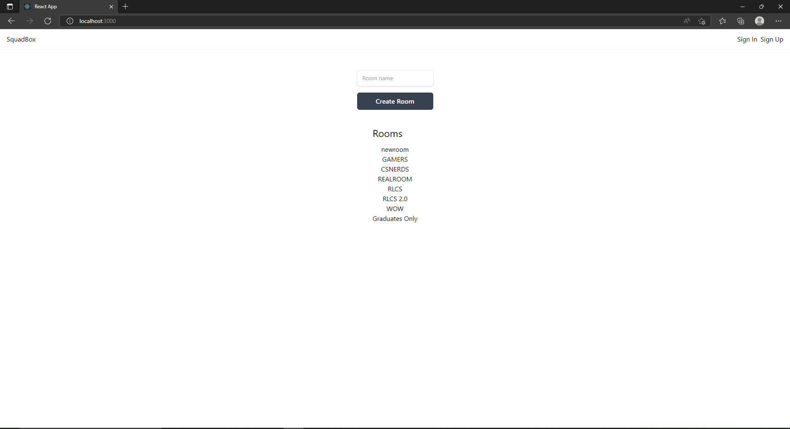
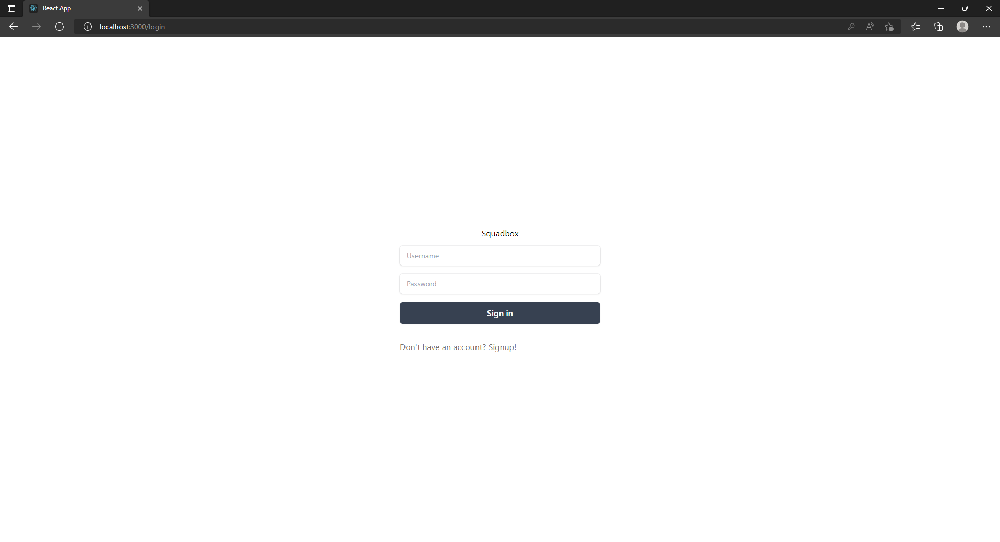
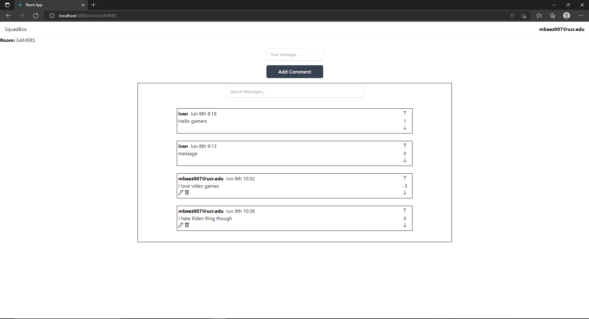

# CS179I Final Project SquadBox

## Overview
For our project we took our lab 6 and added onto it. Using the MERN stack we created a chat app that that has the ability to log on, create rooms, add mesages, upvote/downvote messages, and if you are the author, edit and delete messages. 

## Team
Our team conisted of three people:

Ivan Carillo

Kenneth Alvarez

Marco Baez

## Usage

Screenshots:

 

## How To Run
In the project directory, you can cd to server and run:

### `nodemon server.js`
  
and next in another terminal cd to client and run:

### `npm start`

Runs the app in the development mode. 
Open [http://localhost:3000](http://localhost:3000) to view it in the browser.

The page will reload if you make edits. 
You will also see any lint errors in the console.

